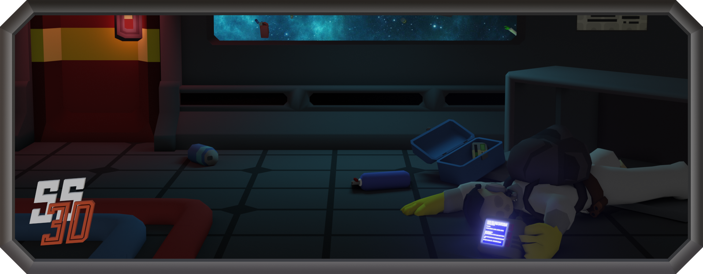

<h3 align="center">RESTful API for managing user registration, authentication, and character storage for<a href="https://ss3d.space/"> Space Station 3D</a>!</h3>

 

## Development Setup

Developing on windows should "just work" (tm) with Visual Studio.
For other platforms - the functional tests use a LocalDB that gets created and destroyed before and after use.
If you cannot setup LocalDB to work the same way without Visual Studio (which manages it on windows), then instead
just try to use an in-memory database.

### Updating migrations

Whenever the database context is update in asp.net, a new migration has to be made so that the update
can be applied to existing servers.

See [the ms docs for more](https://docs.microsoft.com/en-us/ef/core/managing-schemas/migrations/?tabs=dotnet-core-cli#create-a-migration)

## Installation - Production Server

- Clone repository
- Prepare a server with a MySql database.
  If you have an existing database, make sure it's up to date using [asp.net migrations](https://docs.microsoft.com/en-us/ef/core/managing-schemas/migrations/?tabs=dotnet-core-cli#update-the-database)
- Update `appsettings.json`. Specifically the JWT secret, database name, database user and database password.
- Make a build of the API
- Deploy your build to the server of choice. Move your `appsettings.json` to the same folder as `CentCom.dll`
- Launch with `dotnet CentCom.dll`
- The API listens on port 5001 for HTTPS and 5000 for HTTP

## API SPEC
A swagger specification for the API can be found in the [docs folder]((docs/swagger.yaml)).

## Docs

More in-depth documentation for the game-server list can be found in the [docs folder]((docs/server-list.md))
